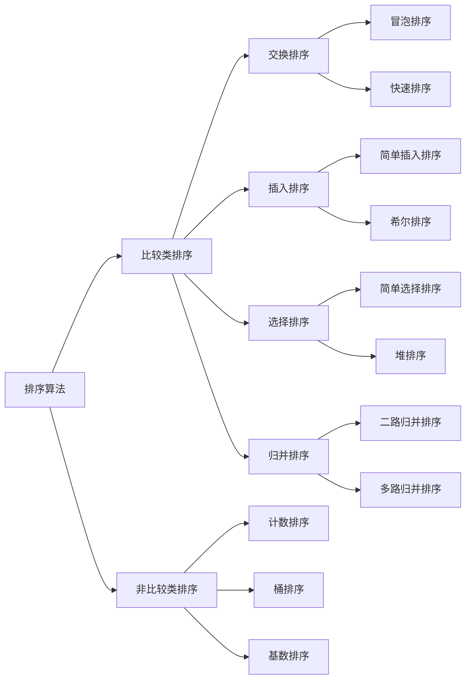

[**参考博客**](https://www.cnblogs.com/onepixel/articles/7674659.html)

# 算法概述

#### 算法分类
- **比较类排序**：通过比较来决定元素间的相对次序，由于其时间复杂度不能突破$O(nlogn)$，因此也称为非线性时间比较类排序。
- **非比较类排序**：不通过比较来决定元素间的相对次序，它可以突破基于比较排序的时间下界，以线性时间运行，因此也称为线性时间非比较类排序。 

#### 算法复杂度
|排序方法|时间复杂度(平均)|时间复杂度(最坏)|时间复杂度(最好)|空间复杂度|稳定性|
|-|-|-|-|-|-|
|冒泡排序|$O(n^2)$|$O(n^2)$|$O(n)$|$O(1)$|稳定|
|快速排序|$O(nlog_2{n})$|$O(n^2)$|$O(nlog_2{n})$|$O(nlog_2{n})$|不稳定|
|简单插入排序|$O(n^2)$|$O(n^2)$|$O(n)$|$O(1)$|稳定|
|希尔排序|$O(n^1.3)$|$O(n^2)$|$O(n)$|$O(1)$|不稳定|
|简单选择排序|$O(n^2)$|$O(n^2)$|$O(n^2)$|$O(1)$|不稳定|
|堆排序|$O(nlog_2{n})$|$O(nlog_2{n})$|$O(nlog_2{n})$|$O(1)$|不稳定|
|二路归并排序|$O(nlog_2{n})$|$O(nlog_2{n})$|$O(nlog_2{n})$|$O(n)$|稳定|
|多路归并排序|-|-|-|-|-|
|-|-|-|-|-|-|
|计数排序|$O(n+k)$|$O(n+k)$|$O(n+k)$|$O(n+k)$|稳定|
|桶排序|$O(n+k)$|$O(n^2)$|$O(n)$|$O(n+k)$|稳定|
|基数排序|$O(d*n)$|$O(d*n)$|$O(d*n)$|$O(n+k)$|稳定|

#### 相关概念
- **稳定**：如果a原本在b前面，而a=b，排序之后a仍然在b的前面。
- **不稳定**：如果a原本在b的前面，而a=b，排序之后 a 可能会出现在 b 的后面。
- **时间复杂度**：对排序数据的总的操作次数。反映当n变化时，操作次数呈现什么规律。
- **空间复杂度**：是指算法在计算机内执行时所需存储空间的度量，它也是数据规模n的函数。 

---

## 冒泡排序

#### 算法描述
1. 一趟排序index从0至n，对每一对相邻元素比较大小，如果第一个比第二个大则交换，这样最大元素**冒泡**至末尾；
2. 排除末尾元素重复步骤1，直至排序完成。

#### 动图演示


#### 复杂度分析
外层循环执行$n-1$次；内层最坏情况循环执行$n$次，最好情况循环执行1次，平均循环执行$\tfrac{n+1}{2}$次。

#### 代码实现
``` JAVA
public int[] bubbleSort(int[] arr){
    int tmp;
    for(int i=0;i<arr.length-1;i++){
        for(int j=0;j<arr.length-1-i;j++){
            if(arr[j]>arr[j+1]){
                tmp = arr[j];
                arr[j] = arr[j+1];
                arr[j+1] = tmp;
            }
        }
    }
    return arr;
}
```

---

## 快速排序

#### 算法描述
快速排序通过分治策略将数组二分后递归排序，具体描述如下：
1. 从数组挑出一个元素作为**基准**；
2. **分区**：重新排序数组，将小于基准的放在基准前，大于基准的放在基准后；
3. 对小于基准和大于基准的数组**递归**分区。

#### 动图演示


#### 复杂度分析
- 最好情况

最好情况下Partition每次都划分得很均匀，如果排序n个关键字，其递归树的深度就为 $[log_2{n}]+1$（$[x]$表示不大于x的最大整数），即仅需递归$log_2{n}$次，需要时间为$T(n)$的话，第一次Partiation应该是需要对整个数组扫描一遍，做n次比较。然后获得的枢轴将数组一分为二，那么各自还需要$T(\tfrac{n}{2})$的时间（注意是最好情况，所以平分两半）。

$$T(n) = n + 2T(\tfrac{n}{2})$$且$$T(1) = 0$$
对上述公式进行递归调用，得到$$T(n) = nT(1) + nlog_2{n} = O(nlog_2{n})$$。

- 最坏情况

当待排序的序列为正序或逆序排列时，且每次划分只得到一个比上一次划分少一个记录的子序列，注意另一个为空。此时递归树是一棵斜树。此时需要执行n‐1次递归调用，且第i次划分需要经过n‐i次关键字的比较才能找到第i个记录，也就是枢轴的位置，因此比较次数为$$\sum^{n-1}_{i=1}(n-i) = 1+2+...+n-1 = \tfrac{n(n-1)}{2}$$，最终时间复杂度为$O(n^2)$。

---

## 简单插入排序

#### 算法描述
插入排序使用in-place（就地）在数组上实现，只需用到$O(1)$的额外空间的排序。
1. 从第一个元素开始，该元素可认为已经排序成功；
2. 一趟排序index从1至n取出元素，在已排序数组从后往前扫描，插入至合适位置；
3. 循环步骤2即可完成排序。

#### 动图演示


#### 复杂度分析
- 最坏情况

在最坏情况下，数组完全逆序，插入第2个元素时要考察前1个元素，插入第3个元素时，要考虑前2个元素，……，插入第N个元素，要考虑前$n-1$个元素。因此，最坏情况下的比较次数是$$1+2+3+...+(n-1) = \tfrac{n^2}{2}$$，所以最坏情况下的复杂度为$O(n^2)$。

- 最好情况

最好情况下，数组已经是有序的，每插入一个元素，只需要考查前一个元素，插入排序的时间复杂度为$O(n)$。

#### 代码实现
``` JAVA
public int[] insertionSort(int[] arr) {
    int preIndex, current;
    for (int i=1;i<arr.length;i++) {
        preIndex = i - 1;
        current = arr[i];
        while (preIndex >= 0 && arr[preIndex] > current) {
            arr[preIndex + 1] = arr[preIndex];
            preIndex--;
        }
        arr[preIndex + 1] = current;
    }
    return arr;
}
```

---

## 希尔排序

#### 算法描述
希尔排序是第一个突破$O(n^2)$的排序算法，是简单插入排序的改进版。它与插入排序的不同之处在于，它会优先比较距离较远的元素，希尔排序又叫缩小增量排序。
1. 选择一个增量序列t1，t2，…，tk，其中ti>tj，tk=1；
2. 按增量序列个数k，对序列进行k趟排序；
3. 每趟排序，根据对应的增量ti，将待排序列分割成若干长度为m的子序列，分别对各子表进行直接插入排序。仅增量因子为1时，整个序列作为一个表来处理，表长度即为整个序列的长度。

#### 动图演示


---

## 简单选择排序

#### 算法描述
选择排序(Selection-sort)是一种简单直观的排序算法。它的工作原理：首先在未排序序列中找到最小（大）元素，存放到排序序列的起始位置，然后再从剩余未排序元素中继续寻找最小（大）元素，然后放到已排序序列的末尾。以此类推，直到所有元素均排序完毕。

#### 动图演示


#### 复杂度分析
表现最稳定的排序算法之一，因为无论什么数据进去都是$O(n^2)$的时间复杂度，所以用到它的时候数据规模越小越好。

---

## 堆排序

#### 算法描述
堆排序是选择排序的改进版，在选择最小（大）元素时使用了小（大）根堆的数据结构，降低了时间复杂度。同时堆排序使用in-place（就地）在数组上实现，只需用到$O(1)$的额外空间的排序。
1. 将初始数组构建为大根堆；
2. 将堆顶元素（最大元素）与最后一个元素交换后从树结构删除（选择），构成一个新的完全二叉树和一个有序数组；
3. 新的完全二叉树可能违反堆的性质，将其调整为新的大根堆；
4. 重复步骤2和步骤3，直至有序数组个数为$n-1$，完成排序。

#### 动图演示


#### 复杂度分析
初始化堆的时间复杂度为$O(n)$，堆重建的时间复杂度为$O(nlog_2{n})$，因此总时间复杂度为$O(nlog_2{n})$。

---

## 二路归并排序

#### 算法描述
归并排序采用分治法。将数组划分子序列，子序列递归进行归并排序，最后将两个（二路归并）有序数组归并为一个有序表。
1. 把长度为n的输入序列分成两个长度为n/2的子序列；
2. 对这两个子序列分别采用归并排序；
3. 将两个排序好的子序列合并成一个最终的排序序列。

#### 动图演示


#### 复杂度分析
总时间=分解时间+解决问题时间+合并时间。
- 分解时间是把数组二分为两个数组所需时间，时间复杂度为$O(n)$；
- 解决问题时间为递归过程，可通过下面递归树解得时间复杂度为$O(nlog_2{n})$；
- 合并时间复杂度为$O(n)$。


因此总时间复杂度为$O(nlog_2{n})$。

---

## 多路归并排序

#### 算法描述

---

## 计数排序

#### 算法描述
计数排序不是基于比较的排序算法，其核心在于将输入的数据值转化为键存储在额外开辟的数组空间中。作为一种线性时间复杂度的排序，计数排序要求输入的数据必须是有确定范围的整数。
1. 扫描序列获得最大值和最小值，构建数组C；
2. 统计数组中每个值为i的元素出现的次数，存入数组C的第i项；
3. 反向填充目标数组：将每个元素i依次放入新数组，每放一个元素就将C(i)减去1。

#### 动图演示


#### 复杂度分析
计数排序是一个稳定的排序算法。当输入的元素是n个0到k之间的整数时，时间复杂度是O(n+k)，空间复杂度也是O(n+k)，其排序速度快于任何比较排序算法。当k不是很大并且序列比较集中时，计数排序是一个很有效的排序算法。

---

## 桶排序

#### 算法描述
桶排序是计数排序的升级版，它利用了函数的映射关系，高效与否的关键就在于这个映射函数的确定。

桶排序的工作的原理：假设输入数据服从均匀分布，将数据分到有限数量的桶里，每个桶再分别排序（有可能再使用别的排序算法或是以递归方式继续使用桶排序进行排）。
1. 设置一个定量的数组当作空桶；
2. 遍历输入数据，并且把数据一个一个放到对应的桶里去；
3. 对每个不是空的桶进行排序；
4. 从不是空的桶里把排好序的数据拼接起来。

#### 动图演示


#### 复杂度分析
桶排序最好情况下使用线性时间$O(n)$，桶排序的时间复杂度，取决与对各个桶之间数据进行排序的时间复杂度，因为其它部分的时间复杂度都为$O(n)$。很显然，桶划分的越小，各个桶之间的数据越少，排序所用的时间也会越少，但相应的空间消耗就会增大。

---

## 基数排序

#### 算法描述
基数排序是按照低位先排序，然后收集；再按照高位排序，然后再收集；依次类推，直到最高位。

有时候有些属性是有优先级顺序的，先按低优先级排序，再按高优先级排序。最后的次序就是高优先级高的在前，高优先级相同的低优先级高的在前。
1. 取得数组中的最大数，并取得位数；
2. arr为原始数组，从最低位开始取每个位组成radix数组；
3. 对radix进行计数排序（利用计数排序适用于小范围数的特点）；

#### 动图演示


#### 复杂度分析
基数排序基于分别排序，分别收集，所以是稳定的。但基数排序的性能比桶排序要略差，每一次关键字的桶分配都需要$O(n)$的时间复杂度，而且分配之后得到新的关键字序列又需要$O(n)$的时间复杂度。假如待排数据可以分为d个关键字，则基数排序的时间复杂度将是$O(d*2n)$，当然d要远远小于n，因此基本上还是线性级别的。

基数排序的空间复杂度为O(n+k)，其中k为桶的数量。一般来说n>>k，因此额外空间需要大概n个左右。
