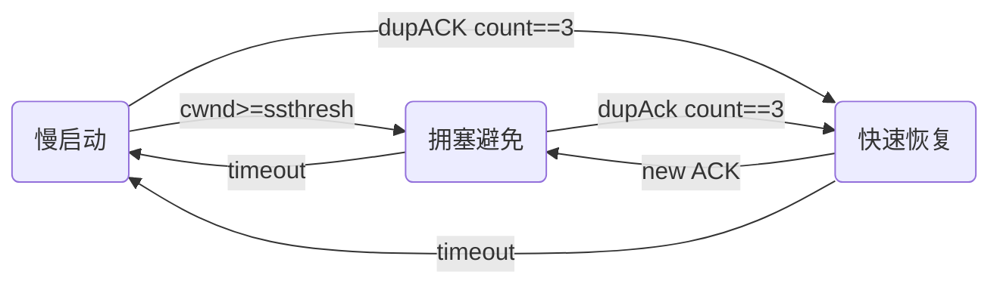
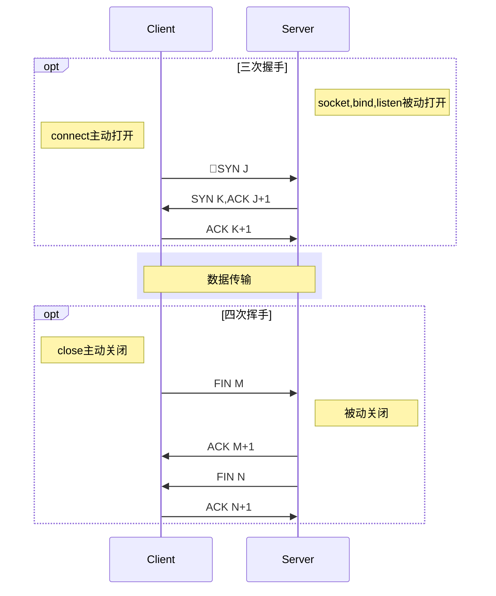

### TCP相比UDP（无连接、全双工）优点
- 提供客户与服务器之间的联系
- 提供可靠性
- 动态估算客户和服务器之间的往返时间
- 通过对每个字节关联序列到对所发送的数据进行排序
- 提供流量控制
- 全双工

### 流量控制与拥塞控制
- 流量控制：接收窗口**rwnd**，*LastByteSent-LastByteAcked<=rwnd*
- 拥塞控制：拥塞窗口**cwnd**，*LastByteSent-LastByteAcked<=min(cwnd, rwnd)*
> 假设cwnd < rwnd，即忽略接收窗口的限制，TCP的cwnd值转换情况为以下状态机。**ssthresh**为慢启动阈值。

> - 慢启动阶段，cwnd为**指数**形式递增；拥塞避免阶段，cwnd为**线性**递增。
> - 每当出现**超时**，状态机均转移至慢启动阶段，且ssthresh=cwnd/2。
> - 每当出现**三个冗余ACK**（拥塞），状态机均转移至快速恢复阶段，且*ssthresh=cwnd/2，cwnd=ssthresh+3MSS*。

### 三次握手与四次挥手

> - 四次挥手步骤1的FIN可能随数据一起发送，步骤2、3也有可能合并。**捎带应答**。
> - 四次挥手步骤2、3之间，Client和Server之间可能继续进行数据传输，成为**半关闭**。

### 状态转换图
```mermaid
graph TB
<!-- Server -->
CLOSED(CLOSED)-.->|应用:被动打开|LISTEN(LISTEN)
LISTEN-.->|接收:SYN,发送:SYN,ACK|SYN_RCVD(SYN_RCVD)
SYN_RCVD-.->|接收:ACK|ESTABLISHED(ESTABLISHED)

ESTABLISHED-.->|接收:FIN,发送:ACK|CLOSE_WAIT(CLOSE_WAIT)
CLOSE_WAIT-.->|应用:关闭,发送:FIN|LAST_ACK(LAST_ACK)
LAST_ACK-.->|接收:ACK|CLOSED
<!-- Server -->

<!-- Client -->
CLOSED-->|应用:主动打开,发送:SYN|SYN_SEND(SYN_SEND)
SYN_SEND-->|应用:关闭 or 超时|CLOSED
SYN_SEND-->|接收:SYN,发送:SYN,ACK,同时打开|SYN_RCVD
SYN_SEND-->|接收:SYN,ACK,发送:ACK|ESTABLISHED

ESTABLISHED-->|应用:关闭,发送:FIN|FIN_WAIT1(FIN_WAIT1)
FIN_WAIT1-->|接收:FIN,发送:ACK|CLOSING(CLOSING)
FIN_WAIT1-->|接收ACK|FIN_WAIT2(FIN_WAIT2)
FIN_WAIT2-->|接收FIN,发送:ACK|TIME_WAIT(TIME_WAIT)
CLOSING-->|接收:ACK|TIME_WAIT
FIN_WAIT1-->|接收:SYN,ACK,发送:ACK|TIME_WAIT
TIME_WAIT-->|2MSL超时|CLOSED
<!-- Client -->
```

> - **实线**表示Client的状态转换，**虚线**表示Server的状态转换
> - **ESTABLISHED**为数据传输状态
> - **同时打开**发生在两端几乎同时发送**SYN**的情况，**同时关闭**（FIN_WAIT1、FIN_WAIT2、CLOSING、TIME_WAIT之间的转换）发生在两端几乎同时发送**FIN**的情况

#### TIME_WAIT
1. **可靠地实现TCP全双工连接的终止**：四次挥手过程中，Client端的最后一个ACK可能丢失，Server需要重发最后的FIN，因此Client必须维护状态信息。
> TCP必须正确处理连接终止序列4个分节的任何一个丢失。
2. **允许老得重复分节在网络中消逝**：在同一个Client和Server的TCP连接关闭一段时间后，新建另一个TCP连接（后一个连接成为前一个连接的**化身**），为了防止前一个连接的重复分组在前一个连接终止发起新的化身后出现，TCP将**不允许处于TIME_WAIT状态的连接发起新的化身**。


##### *以上内容参考《UNIX网络编程》第二章*