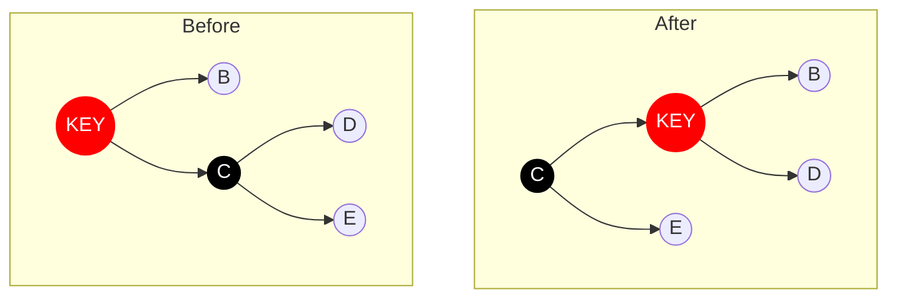
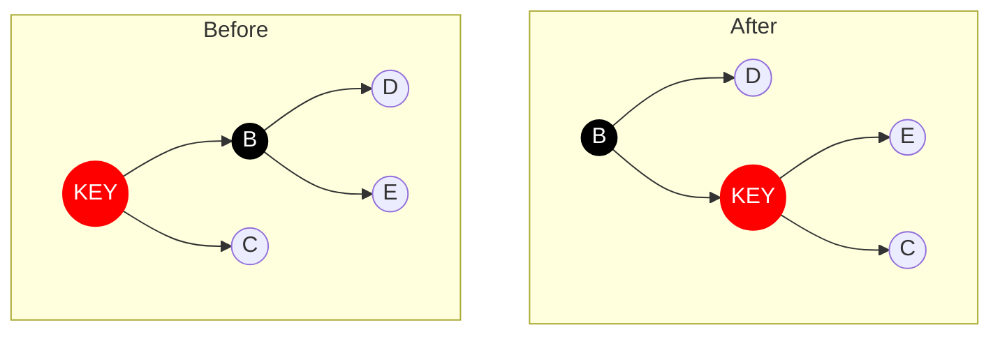
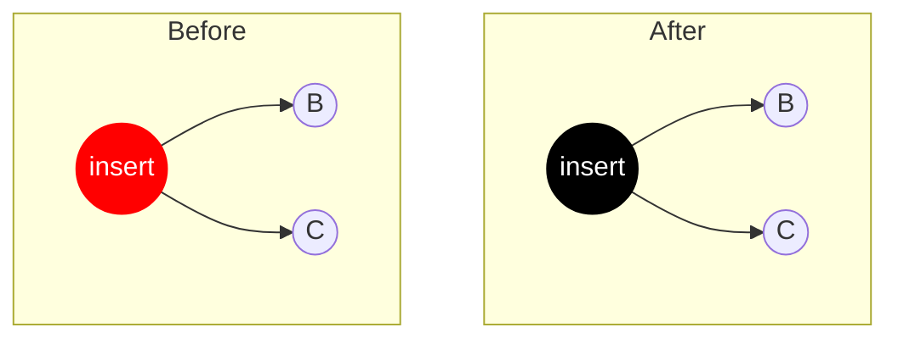
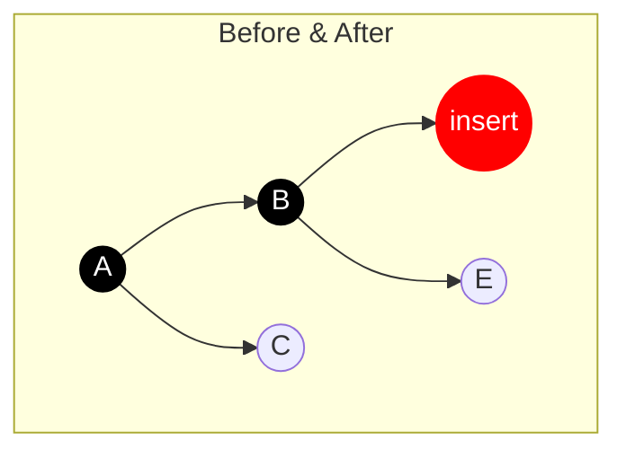
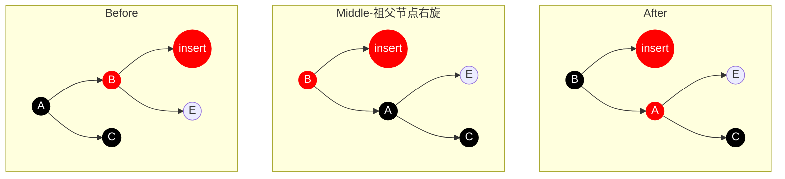
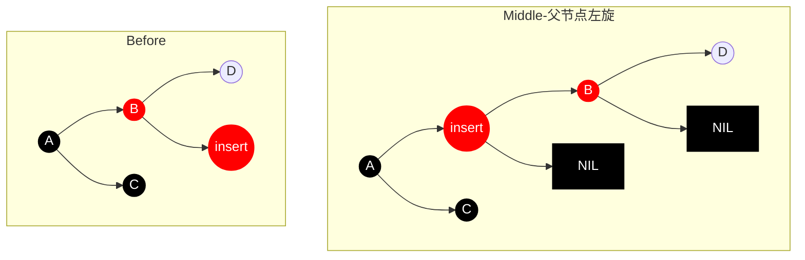
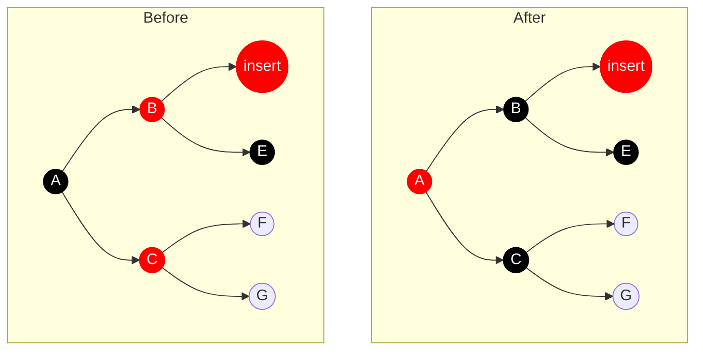
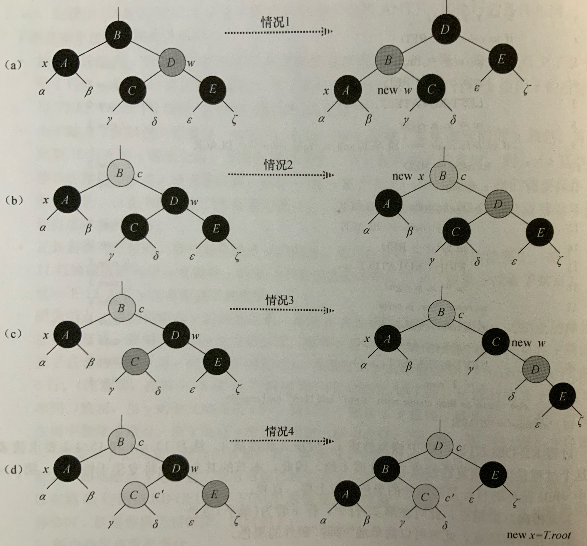

# 概述
红黑树是一个不完美的平衡二叉树。
为了解决平衡二叉树在动态插入时保持树平衡性需要较高的代价这个问题，且不影响查询代价，因此放松平衡二叉树的限制条件并增加一些性质，红黑树产生了！

# 性质
1. 节点是红色或黑色
2. 根节点是黑色
3. 每个叶节点（NIL）是黑色
4. 红色节点的子节点都是黑色（不存在两个连续的红色节点）
5. 任意节点到其子孙节点的路径（用*pathLen*表示）均包含相同数量的黑色节点

> **性质5**确定```max(pathLen) / min(pathLen) < 2```，因此可以说R-B Tree是接近平衡的二叉搜索树。

# 查询时间复杂度

# 基本操作
## 左旋、右旋
> 左旋（右旋）意味着被旋转的节点变为一个左节点（右节点）
- 左旋

- 右旋

## 插入
执行插入操作需要以下三步：
1. 将红黑树当作一颗二叉查找树插入节点
2. 将插入的节点着色为“红色”（如果着色为“黑色”会破坏性质5，而着色为“红色”会破坏性质4，明显性质5比性质4更难保持）
3. 通过一系列的旋转或着色等操作，使之重新成为一颗红黑树

第三步又分为以下三种情况：
### 1.插入节点为根节点

### 2.插入节点父节点为黑色

> *不做任何操作即可*
### 3.插入节点父节点为红色，且父节点为左节点（如果为右节点，则为镜像）
#### A.叔节点为黑色
> 总结
> - 左旋、右旋时需要保持**红色节点为父子关系**，后续再通过换色来满足*性质4*，即红色节点不连续
> - 换色时需要注意*性质2*，即根节点必须为黑色
##### (1)插入节点为左节点

##### (2)插入节点为右节点

> **父节点左旋后转换为A(1)的情况！**
#### B.叔节点为红色

## 删除
执行删除操作类似于插入，需要以下两步：
1. 将红黑树当作一颗二叉查找树删除节点
    - 如果删除节点是叶节点，则直接删除
    - 如果删除节点包含一个子节点，则将该子节点直接移动到被删除位置
    - 如果删除节点包含两个子节点，则将右节点最小值与删除节点值互换（红黑树不替换颜色），然后将删除节点值新位置的节点删除
2. 通过"旋转和重新着色"等一系列来修正该树，使之重新成为一棵红黑树

> 红黑树的删除规则过于复杂，建议直接参考《算法导论》红黑树章节。

假设被删除的节点是y。
1. y是红色节点则直接删除
2. y是黑色节点。y节点被删除后，x节点占据了y节点的位置，为了满足*性质5*，从而假设x为额外黑色（包含两个黑色）

接下来对x节点进行处理，从而使得最后的红黑树满足全部性质。
- (a) x的兄弟节点w是红色
- (b) x的兄弟节点w是黑色，且w的两个子节点都是黑色
- (c) x的兄弟节点w是黑色，w的左孩子是红色，w的右孩子是黑色
- (d) x的兄弟节点w是黑色，w的右孩子是红色

对x节点循环，直到：
- x指向红黑节点，此时直接将x置为黑色节点
- x指向根节点，将x额外黑色移除
- 执行适当的旋转和重新着色



**(a)会转换为(b)，(b)会转换为其他，(c)会转换为(d)，(d)将x设置为根节点退出循环**