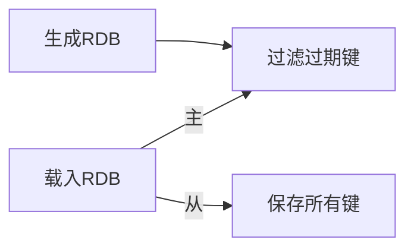

# 单机数据库的实现
## 数据结构
```
redis.h/redisServer  //Redis服务器
struct redisServer {
    redisDb *db;  //保存服务器所有数据库的数组
    int dbnum;  //服务器数据库数量，默认16
    //...
};

//Redis客户端
typedef struct redisClient {
    redisDb *db;  //记录客户端当前使用的数据库
    //...
} redisClient;

//redis.h/redisDb  // Redis数据库结构
typedef struct redisDb {
    dict *dict;  //数据库键空间
    dict *expires;  //过期字典
    //...
} redisDb;
```

>数据库的键空间是一个字典，因此所有针对数据库的操作，都是通过对键空间字典进行操作来实现的。
## 过期时间
```
//设置生存时间ttl（time to live），P开头为ms，否则为s
EXPIRE <key> <ttl>
PEXPIRE <key> <ttl>

//设置过期时间
EXPIREAT <key> <timestamp>
PEXPIREAT <key> <timestamp>

//计算并返回剩余生存时间
TTL <key>
```
>```EXPIRE```、```PEXPIRE```、```EXPIREAT```均通过```PEXPIREAT```实现。

>通过查询过期字典获得的过期时间与当前时间做比较判断键是否过期。
### 过期键删除
- 定时删除：创建定时器。对CPU不友好，对内存友好。
- 惰性删除：读写键时判断是否过期，过期则删除。对内存不友好，对CPU友好。
- 定期删除：每隔一段时间检查过期键并删除。
>Redis采用惰性删除和定期删除两种策略的配合。

>定期删除会记录上一次检查过期键的进度并保存，在下次开始执行时继续。
### AOF、RDB和复制对过期键处理
- RDB

-  AOF
AOF生成载入均不对键做任何处理。当过期键被删除，程序会向AOF文件append一跳DEL命令。
- 复制
主服务器删除过期键，会向所有从服务器发送DEL命令