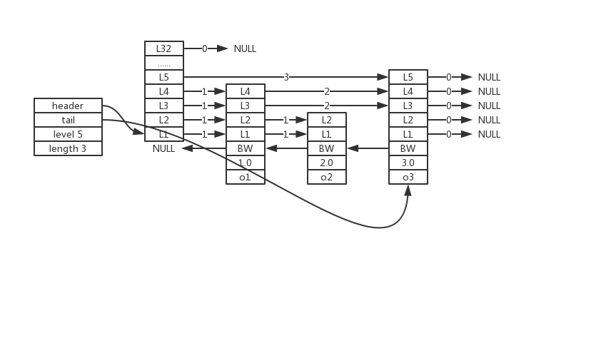
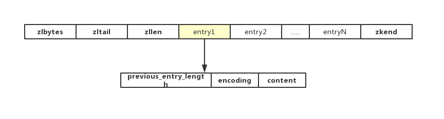
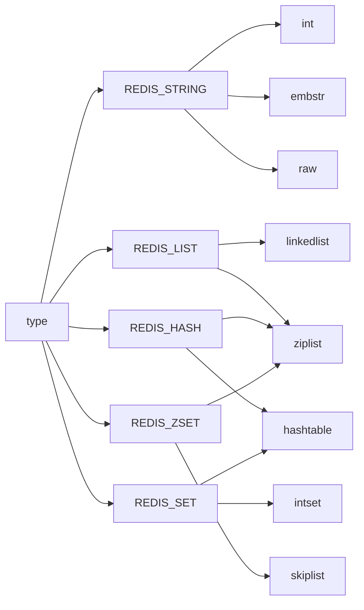
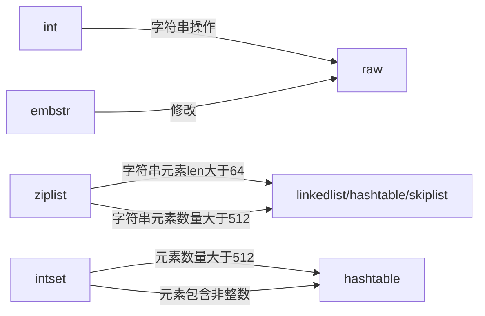

# 简单动态字符串（SDS，Simple Dynamic String）
## 数据结构
```
sds.h/sdshdr  //SDS
struct sdshdr {
    int len;  //字符串长度
    int free;  //buf数组未使用字节数量
    char buf[];  //字节数组，保存二进制数据
}
```
>buf在字符串末尾**透明的**保存了空字符串'\0'，且这额外的1字节空间不计算在SDS的len中。

## SDS相比C字符串更适用Redis的原因
1. SDS获取字符串长度复杂度为$O(1)$，C字符串为$O(n)$。
2. 增长或缩短一个C字符串均需要内存重分配（涉及复杂的算法，并可能需要执行系统调用，比较耗时），SDS通过free解除字符串长度和底层数组长度关联，并实现空间预分配和惰性空间释放两种优化策略：
    - 空间预分配
        - free够用，直接使用
        - free不够，执行内存分配；len小于1M则free=len，否则free=1M
    - 惰性空间释放
        - 字符串缩短操作，用free记录缩短字节数
3. 二进制安全：C字符串字符必须符合某种编码（比如ASCII），并且除了字符串末尾外不能包含空字符影响字符串结尾判断，因此限制C字符串只能保存文本数据；SDS适用len判断字符串是否结束，且以二进制的方式来处理buf数组。
4. 遵循C字符串以'\0'结尾的管理，SDS可以兼容部分C字符串函数。

---

# 链表
## 数据结构
```
adlist.h/listNode  //链表
typedef struct listNode {
    struct listNode *prev;  //前置节点
    struct listNode *next;  //后置节点
    void *value;  //节点值
} listNode;

addlist.h/list  //链表节点
typedef struct list {
    listNode *head;  //表头节点
    listNode *tail;  //表尾节点
    unsigned long len;  //链表所包含节点数量
    void *(*dup) (void *ptr);  //节点复制函数
    void *(*free) (void *ptr);  //节点释放函数
    int (*match) (void *ptr,void *key);  //节点值比对函数
} list;
```

## Redis链表特性
1. 双端、无环、带表头指针和表尾指针（双向链表）
2. 链表长度计数器，获得节点数量复杂度$O(1)$
3. 多态：链表节点使用void*指针来保存节点值，并可以通过list结构的dup、free、match三个属性为节点设置类型特定函数，所以链表可以用于保存各种不同类型的值

---

# 字典
## 数据结构
```
dict.h/dictht  //哈希表
typedef struct dictht {
    dictEntry **table;  //哈希表数组，指向指针（dictEntry地址）的指针（数组地址）
    unsigned long size;  //哈希表大小
    unsigned long sizemask;  //哈希表大小掩码，用于计算索引值；总等于size-1
    unsigned long used;  //该哈希表已有节点数量
} dictht

dict.h/dictEntry  //哈希表节点
typedef struct dictEntry {
    void *key;  //键
    union{
        void *val;
        uint64_t u64;
        int64_t s64;
    } v;  //值
    struct dictEntry *next;  //指向下个哈希表节点，形成链表；解决键冲突问题
} dictEntry

dict.h/dict  //字典
typedef struct dict {
    dictType *type;  //类型特定函数
    void *privdata;  //私有数据
    dictht ht[2];  //哈希表：字典使用ht[0]，ht[1]只会在ht[0]rehash时使用
    int trehashidx;  //rehash索引；当rehash不在进行时，值为-1
} dict;

typedef struct dictType {
    unsigned int (*hashFunction) (const void *key);  //计算哈希值的函数
    void *(*keyDup) (void *privdata, const void *key);  //复制键的函数
    void *(*valDup) (void *privdata, const void *obj);  //复制值的函数
    int *(*keyCompare) (void *privdata, const void *key1, const void *key2);  //对比键的函数
    void (*keyDestructor) (void *privdata, void *key);  //销毁键的函数
    void (*valDestructor) (void *privdata, void *obj);  //销毁值的函数
} dictType;
```
>type属性和privdata属性是针对不同类型的键值对，为创建多态字典而设置：
> - type属性是一个指向dictType结构的指针，每个dictType结构保存了一簇用于操作特定类型键值对的函数，Redis会为用途不同的字典设置不同的类型特定函数。
> - privdata属性保存了需要传给那些特定函数的可选参数。

## 字典操作
### 哈希算法
```
hash = dict->type->hashFunction(key);  //使用字典设置的哈希函数，计算key的哈希值
index = hash & dict->ht[x].sizemask;  //&运算得索引值，根据情况选择ht[0]/ht[1]
```

### 解决键冲突
由于dictEntry节点组成的链表没有指向链表表尾的指针，因此新节点添加至表头(复杂度$O(1)$)。

### rehash
为了使哈希表的负载因子维持在合理范围，当哈希表键值对数量过多或过少时，可以通过rehash对哈希表进行扩展或收缩。
>负载因子 = 总键值对数 / 桶个数，即 ```load_factor = ht[0].used / ht[0].size```

Redis会在以下情况对哈希表执行扩展操作：
- 服务器没有执行BGSAVE/BGREWRITEAOF命令，且```load_factor >= 1```
- 服务器执行BGSAVE/BGREWRITEAOF命令，且```load_factor >= 5```
>执行BGSAVE/BGREWRITEAOF命令Redis需要创建当前服务器进程的子进程，大多数操作系统都采用**写时复制**（**copy-on-right**）技术来优化子进程的使用效率，因此提高执行扩展所需的*load_factor*从而尽可能避免在子进程存在期间进行哈希表扩展操作，避免不必要的内存写入操作，最大限度节约内存。

当```load_factor < 0.1```时Redis执行收缩操作。

以下是哈希表rehash的详细步骤：
1. 为ht[1]分配空间。如果是扩展操作，ht[1]空间大小为第一个大于等于```ht[0].used*2```的$2^n$；如果是收缩操作，ht[1]空间大小为第一个大于等于```ht[0].used```的$2^n$；
2. 将ht[0]中的所有键值对rehash到ht[1]上；
3. 释放ht[0]，将ht[1]设置为ht[0]，并在ht[1]创建一个空白哈希表。

### 渐进式rehash
因为ht[0]中键值对数量可能很庞大，一次性rehash庞大的计算量可能会导致服务器在一段时间内停止服务。因此将ht[0]中的键值对rehash到ht[1]的过程是分多次、渐进式的。

以下是哈希表渐进式rehash的详细步骤：
1. 为ht[1]分配空间（同上）；
2. 在字典中维持一个索引计数器```rehashidx = 0```，表示rehash工作正式开始。
3. rehash进行期间，每次对字典进行CURD操作时候，除了执行指定操作外还会对*rehashidx*索引上的所有键值对rehash到ht[1]，完成后```rehashidx++```；
4. 当ht[0]的全部键值对rehash至ht[1]时，设置```rehashidx = -1```表示rehash完成。
>rehash期间，字典的CURD会在ht[0]和ht[1]同时进行，且新增的键值对只会保存到ht[1]中，查找时需从ht[0]、ht[1]按照顺序查找。

---

# 跳跃表
## 数据结构
跳跃表支持平均$O(log_2{n})$、最坏$O(n)$复杂度的节点查找，还可以通过顺序性操作批量处理节点。
```
redis.h/zskiplist  //跳表
typedef struct zskiplist {
    struct skiplistNode *header, *tail;  //表头节点和表尾节点
    unsigned long length;  //表中节点数量
    int level;  //表中层数最大的节点层数
} zskiplist;

redis.h/zskiplistNode  //跳表节点
typedef struct zskiplistNode {
    struct zskiplistNode *backward;  //后退指针，从表尾向表头遍历使用
    double score;  //分值，跳跃表所有节点按照score从小到大排序
    robj *obj;  //成员对象
    struct zskiplistLevel {
        struct zskiplistNode *forward;  //前进指针
        unsigned int span;  //跨度
    } level[];  //层
} zskiplistNode;
```


---

# 整数集合
## 数据结构
```
intset.h/intset  //整数集合
typedef struct intset {
    unit32_t encoding;  //编码方式
    unit32_t length;  //集合包含元素数量
    int8_t contents[];  //保存元素的数组
} intset;
```
>contents真正类型取决于encoding。
>|encoding|contents|
>|-|-|
>|INTSET_ENC_INT16|int16_t|
>|INTSET_ENC_INT32|int32_t|
>|INTSET_ENC_INT64|int64_t|

## 升级
当添加一个新元素到整数集合中时，且新元素的类型逼整数集合现在所有元素的类型都长时，会触发升级操作。
>如果添加的元素为int32_t类型，但是int16_t即可存储，则不触发升级。
1. 根据新元素的类型，扩展整数集合底层数组空间大小，并为新元素分配空间；
2. 将底层数组所有现有元素都转换为新的类型，且保持有序性放在正确位置；
3. 新元素添加至底层数组（新数组小于所有元素或大于所有元素，底层数组索引0或length-1）；
4. 修改encoding和length属性。
> 整数集合不支持降级。

升级的好处如下：
- 提升灵活性：添加元素不需要考虑类型问题
- 节约内存：尽量使用位数小的类型

---

# 压缩列表
## 数据结构

### 压缩表的构成

|属性|类型|长度|用途|
|-|-|-|-|
|zlbytes|uint32_t|4字节|压缩表占用内存字节数，在对压缩表进行内充重分配或计算zlend位置时使用|
|zltail|uint32_t|4字节|压缩表表尾节点距离起始地址字节数|
|zllen|uint16_t|2字节|压缩表节点数量（大于UINT16_MAX需遍历）|
|zleng|uint8_t|1字节|特殊值OxFF，标记压缩表末端|

### 压缩表节点的构成
##### 1. previous_entry_length
记录压缩表前一个节点的长度，因此可以通过指针运算，根据当前节点的起始地址计算前一个节点的起始地址。
> - 如果前一节点长度小于254字节，则previous_entry_length为1字节保存长度；
> - 如果大于等于254字节，则previous_entry_length为5字节，第一字节为0xFE（十进制254），后面4字节保存长度
##### 2. encoding
记录节点content属性所保存数据的类型及长度：
> - 1字节、2字节、5字节长度，值的最高位为00、01、10的是字节数组编码，数组长度由编码去掉最高两位之后的其他位记录；
> - 1字节，值得最高位为11的是整数编码，整数值的类型和长度由编码除去最高两位的其他位记录；
##### 3. content
保存节点的值，节点值的类型和长度由节点的encoding属性决定。

## 连锁更新
添加新节点或者删除节点，导致**新增节点**或者**删除节点前一节点**的长度无法被**后一节点**的previous_entry_length无法存储，依次类推就会导致连锁更新。
>一个节点A的previous_entry_length增加4字节（从1字节变为5字节），导致下一个压缩表节点B的previous_entry_length的值加4，那么如果B的节点大小介于250字节至253字节，则B也会触发B的下一个节点的更新。以此类推就是连锁更新。

连锁更新在最坏情况下需要对压缩表执行N次空间分配操作，而每次空间重新分配的最好复杂度是$O(n)$，所以连锁更新的最坏复杂度是$O(n^2)$。

>尽管连锁更新复杂度较高，但是造成性能问题的几率很低：
> - 首先压缩表里要恰好由多个连续的、长度介于250字节至253字节之间的节点，连锁更新才有可能被触发；
> - 其次即使出现连锁更新，但只要节点数量不多，就不会对性能造成任何影响。

---

# 对象
## 数据结构
```
//Redis对象
typedef struct redisObject {
    unsigned type:4;  //类型
    unsigned encoding:4;  //编码
    void *ptr;  //指向底层数据结构的指针
    int refcount;  //引用计数
    unsigned lru:22;  //最后一次被命令程序访问时间
    //...
} robj;

//有序集合
typedef struct zset {
    zskiplist *zsl;  //跳跃表
    dict *dict;  //字典
} zset;
```
>有序集合同时使用跳跃表和字典，跳跃表适合范围型操作，字典$O(1)$复杂度查找成员，空间换时间。
##### 对象的type属性列表
|对象|type属性|*TYPE*命令输出|
|-|-|-|
|字符串对象|REDIS_STRING|“string”|
|列表对象|REDIS_LIST|“list”|
|哈希对象|REDIS_HASH|“hash”|
|集合对象|REDIS_SET|“set”|
|有序集合对象|REDIS_ZSET|“zset”|
##### 对象的encoding属性列表
|编码常量|编码所对应的底层数据结构|
|-|-|
|REDIS_ENCODING_INT|long类型的整数|
|REDIS_ENCODING_EMBSTR|embstr编码的简单动态字符串（redisObject和sdshdr空间相连）|
|REDIS_ENCODING_RAW|简单动态字符串|
|REDIS_ENCODING_HT|字典|
|REDIS_ENCODING_LINKEDLIST|双端链表|
|REDIS_ENCODING_ZIPLIST|压缩列表|
|REDIS_ENCODING_INTSET|整数集合|
|REDIS_ENCODING_SKIPLIST|跳跃表和字典|
##### type与encoding对映关系

## 编码转换
>编码转换只需要注重底层数据结构是如何转换即可。

>- embstr只读
>- ziplist转换为linkedlist/hashtable/skiplist取决于redisObject是list/hash/zset
## 对象共享
初始化服务器时，创建0-9999的整数字符串对象用于共享。
>一个共享对象保存的值越复杂，验证共享对象和目标对象是否相同所需复杂度越高，消耗的CPU时间越多。因此Redis只对包含整数值的字符串对象进行共享。
## 内存回收
$$空转时长 = 当前时间 - lru$$
当打开了maxmemory选项，且内存回收算法为volatile-lru或allkeys-lru时，当内存超过maxmemory上限，空转时长高的部分键会被释放，完成内存回收。