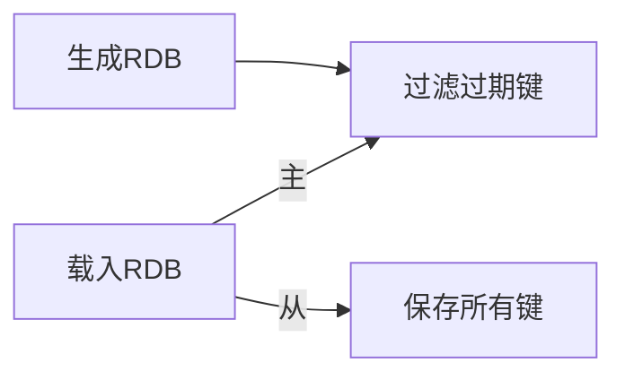

了解Redis单机数据库的具体实现，才能真正掌握Redis的优势所在。

<!--more-->

# 单机数据库的实现
## 数据结构
```
redis.h/redisServer  //Redis服务器
struct redisServer {
    redisDb *db;  //保存服务器所有数据库的数组
    int dbnum;  //服务器数据库数量，默认16
    //...
};

//Redis客户端
typedef struct redisClient {
    redisDb *db;  //记录客户端当前使用的数据库
    //...
} redisClient;

//redis.h/redisDb  // Redis数据库结构
typedef struct redisDb {
    dict *dict;  //数据库键空间
    dict *expires;  //过期字典
    //...
} redisDb;
```


>数据库的键空间是一个字典，因此所有针对数据库的操作，都是通过对键空间字典进行操作来实现的。
## 过期时间
```
//设置生存时间ttl（time to live），P开头为ms，否则为s
EXPIRE <key> <ttl>
PEXPIRE <key> <ttl>

//设置过期时间
EXPIREAT <key> <timestamp>
PEXPIREAT <key> <timestamp>

//计算并返回剩余生存时间
TTL <key>
```
>```EXPIRE```、```PEXPIRE```、```EXPIREAT```均通过```PEXPIREAT```实现。

>通过查询过期字典获得的过期时间与当前时间做比较判断键是否过期。
### 过期键删除
- 定时删除：创建定时器。对CPU不友好，对内存友好。
- 惰性删除：读写键时判断是否过期，过期则删除。对内存不友好，对CPU友好。
- 定期删除：每隔一段时间检查过期键并删除。
>Redis采用惰性删除和定期删除两种策略的配合。

>定期删除会记录上一次检查过期键的进度并保存，在下次开始执行时继续。
### AOF、RDB和复制对过期键处理
- RDB

-  AOF
AOF生成载入均不对键做任何处理。当过期键被删除，程序会向AOF文件append一条DEL命令。
- 复制
主服务器删除过期键，会向所有从服务器发送DEL命令

--- 

# RDB持久化
## RDB文件的创建与载入
RDB文件是一个经过压缩的**二进制文件**，通过该文件可以完成数据库状态还原。
```SAVE```和```BGSAVE```命令用于创建RDB文件，```SAVE```会直接阻塞服务器（拒绝一切命令），```BGSAVE```会派生子进程负责创建RDB文件。
>AOF的更新频率更高，优先级更高。

### 自动间隔性保存
```
struct redisServer {
    //...
    struct saveparam *saveparams;  //保存条件的数组
    long long dirty;  //修改计数器，每次修改操作+1
    time_t lastsave;  //上一次执行保存的时间
    //...
};

//seconds秒内至少进行changes次修改则进行BGSAVE命令
struct saveparam {
    time_t seconds;  //秒数
    int changes;  //修改数
};
```
Redis服务器的周期性操作函数```serverCron```默认每100毫秒执行一次，其一项工作就是遍历检查saveparams中的保存条件，满足则执行```BGSAVE```;
## RDB文件结构

>- INTSET将整数集合转换为字符串对象后保存；
>- ZIPLIST将压缩表对象转换为字符串对象后保存。

TYPE记录了value的类型，列表如下：
- REDIS_RDB_TYPE_STRING
- REDIS_RDB_TYPE_LIST
- REDIS_RDB_TYPE_SET
- REDIS_RDB_TYPE_ZSET
- REDIS_RDB_TYPE_HASH
- REDIS_RDB_TYPE_LIST_ZIPLIST
- REDIS_RDB_TYPE_SET_INTSET
- REDIS_RDB_TYPE_ZSET_ZIPLIST
- REDIS_RDB_TYPE_HASH_ZIPLIST

--- 

# AOF（Append Only File）持久化
## AOF持久化的实现
```
struct redisServer {
    //...
    sds aof_buf;  //AOF缓冲区
    //...
};
```
>Redis服务器进程就是一个事件循环。循环中的文件事件负责接收客户卷的命令请求，以及向客户端发送命令回复；而时间事件则负责执行像```serverCron```这样定时运行的函数。
- 命令追加：服务器在执行完一个命令后，会以协议格式将被执行的写命令追加到服务器状态的aof_buf缓存区末尾。
- 文件写入：事件循环前根据服务器```appendfsync```配置调用```flushAppendOnlyFile```判读是否将aof_buf缓存区内容写入AOF文件。
- 文件同步：操作系统write数据到文件时，会先暂存到内存缓冲区。文件同步则通过```fsync```和```fdatasync```函数，强制让操作系统立即将缓冲区数据写到硬盘。

|appendfsync配置|flushAppendOnlyFile函数行为|
|-|-|
|always|将aof_buf全部数据写入并同步到AOF文件|
|everysec|将aof_buf全部数据写入并同步到AOF文件，如果上次同步AOF文件的时间距离现在超过一秒钟，则再次同步，且这个同步操作是由一个线程专门负责执行|
|no|将aof_buf全部数据写入到AOF文件，何时同步由操作系统来决定|
## AOF数据还原与重写
>服务器只需要读取并重新执行一次AOF文件保存的写命令即可完成数据还原。

**由于AOF随着服务器运行时间流逝会原来越大，Redis提供了AOF文件重写。**

**AOF重写通过读取数据库当前状态即可，一个键一条命令。**
>为了避免执行命令时造成客户端输入缓冲区溢出，重写程序在处理列表、哈希表、集合、有序集合四种可能有多个元素的键时，如果数量超过了```redis.h/REDIS_AOF_REWRITE_ITEMS_PER_CMD```常量，则使用多条命令来记录键值。
## AOF后台重写
当子进程进行AOF重写时，父进程处理的命令请求会添加到AOF重写缓冲区，当子进程完成AOF重写后会在新的AOF文件末尾追加AOF重写缓冲区的命令内容。
>在整个AOF后台重写过程中，只有信号处理函数执行时会对服务器进程（父进程）造成阻塞。

--- 
