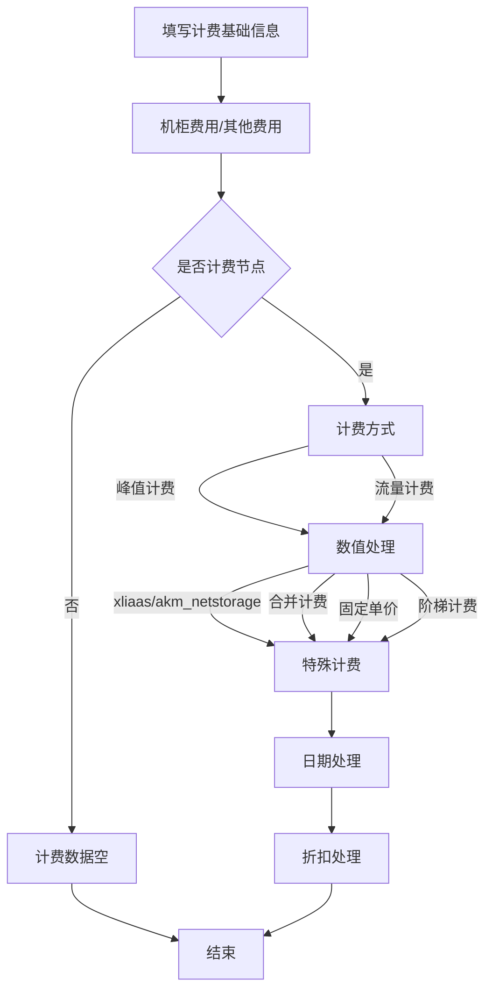

# 概述
**天工计费系统**是为商务人员开发，用于录入计费相关信息，计算和记录爱奇艺所有**数据中心**(IDC)产生的带宽、机柜等费用的系统。同时为了方便商务人员统计，提供了图形化展示与丰富的**计费报表**。
# 基本概念及系统设计
## 一、计费单元
计费单元是按数据中心为维度，所有的计费信息包括带宽、机柜、其他费用等的汇总。
### 分类
1. 按照资源类型：自建CDN、商业CDN、BGP、海外带宽、合作带宽、闲置带宽
2. 按照运营商：主要包括电信、移动、联通
>由于数据库设计问题，资源类型（resource_type）和运营商（operator_type）有混淆，计费IDC和商业CDN的详细分类见：
>
>```BpsBaseBillIdcModel::getBillClassify()和BpsBaseBillIdcModel::getHcdnClassify()```
### 计费规则
1. 填写IDC计费基础信息、计算峰值数据、计算机柜*bps_bill_idc_cabinet*和其他*bps_bill_idc_other*费用。
2. 首先*bps_bill_idc_fees*表中的*time*和*peak*字段均不为空，则为计费节点；否则为非计费节点。
3. 计费流量：流量计费则计算计费时期内流量总和，峰值计费则需要选择对应的峰值类型。
4. 流量数值特殊处理：计费值大于容量、不足X兆按X兆计算、峰值向上取证*ceil_peak*，需要对上述流量值进一步处理。
5. 如果查询时间内有IDC容量变更记录，则需要判断特殊情况：月中扩容（新建）、月中下线。
6. 如果有折扣记录，则再次进行折扣计算。
>注意：不同计费单元，峰值单位换算方式不同；自建CDN均为$$bps/1000^3$$，商业CDN按照$$1000^3$$或$$1024^3$$。


## 二、公有费用
##### 1. 传输专线费用*bps_bill_idc_special_line*
##### 2. 特殊资源费用*bps_bill_special_resource*
##### 3. 补充计提费用*bps_bill_idc_accrued*

## 三、计费库
```
'contract' => [
    'class'=> 'yii\db\Connection',
	'dsn' => 'mysql:host=bj.contract.w.qiyi.db;dbname=contract;port=8635',
	'emulatePrepare' => true,
	'username' => 'contract',
	'password' => 'BPguUKG1',
	'charset' => 'utf8',
],
```
>```dbname=contract_test```为测试库

|表名|描述|
|-|-|
|bps_base_bill_idc|计费单元|
|bps_bill_idc_fees|计费单元计费信息|
|bps_bill_idc_cabinet|计费单元机柜费用|
|bps_bill_idc_other|计费单元其他费用|
|**公有费用**|-|
|bps_bill_idc_special_line|传输专线费用|
|bps_bill_idc_accrued|补充计提费用|
|bps_bill_special_resource|特殊资源费用|
|**费用计算**|-|
|bps_bill_idc_merge|合并计费|
|bps_bill_idc_ladder|阶梯计费|
|**备份表**|-|
|bps_bill_idc_backup|计费结果数据备份表|
|bps_bill_idc_peaks|计费峰值备份表|
|bps_bill_idc_summary|年度汇总备份表|

## 四、计费脚本
##### 1. 峰值备份（每日）
- 自建CDN：0 06 * * * /usr/bin/php /data/projects/portal/yii-pro BpsBillIdcPeaks/BillIdcPeaks >> /data/logs/contract/BillIdcPeaks.log 2>&1
- 商业CDN：0 09 * * * /usr/bin/php /data/projects/portal/yii-pro BpsBillIdcPeaks/HcdnPeaks >> /data/logs/contract/HcdnPeaks.log 2>&1

##### 2. 计费结果数据备份（每日）
20 09 * * * /usr/bin/php /data/projects/portal/yii-pro BpsBillIdcBackup >> /data/logs/contract/BpsBillIdcBackup.log 2>&1
##### 3. 闲置带宽重算（每日）
0 06 * * * /usr/bin/php /data/projects/portal/yii-pro BpsBillIdcPeaks/GetIdleBandwidth >> /data/logs/contract/GetIdleBandwidth.log 2>&1
##### 4. 计费流量邮件（每日）
30 11 * * * /usr/bin/php /data/projects/portal/yii-pro BpsBillIdcPeaks/BpsBillIdcTraffic >> /data/logs/contract/BpsBillIdcTraffic.log 2>&1
##### 5. 合并IDC数据备份（每月底）
0 09 1 */1 * /usr/bin/php /data/projects/portal/yii-pro BpsBillIdcPeaks/BackupMergeIdc >> /data/logs/contract/BackupMergeIdc.log 2>&1